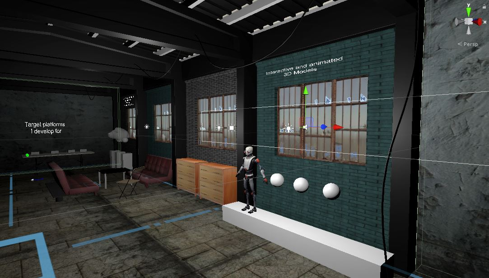

# AR/VR Art|Design|Development Studio

### Project description: 
This project is part of the coursera course *3D Models for Virtual Reality*.
It showcases several facets of my work with Virtual Reality (VR), such as 3D modeling with VR Tools, development and programming.
Therefore I've created a factory environment. Within this environment you will experience artwork I've made with VR Software, such as 3D models made with Tilt Brush, Quill, Medium, Blocks etc. You will see traditional 2D videos I've made in VR for others, as well as development work I've done in this field with Unity.   

### Project requirements: 
- [x] You should have a brief description of your scene
- [x] This description should give instructions
- [x] The description should give any restrictions on hardware needed to run the scene
- [x] The scene should contain several 3D objects
- [x] The object should be arranged with transforms to form a scene
- [x] The scene should be viewable in VR
- [x] The objects should have materials including textures
- [x] The scene should be scaled appropriately for VR
- [ ] The scene should have appropriate lighting
- [ ] (Optional) The scene can have animation
- [ ] (Optional) The scene can include audio
- [ ] The project should represent a real or imaginary scene

### Development platform: 
Windows 10, Unity 2019.1.14f1, 
Visual Studio community 2017 version 15.9.17, SteamVR Plugin 2.5.0 (sdk 1.8.19), 
Scripting Runtime Version: .NET 4.x Equivalent

### Target platform: 
Oculus Rift S/Rift/Vive

### Visuals: 
First sketch:

First screenshot MainScene: 

### Necessary setup/execution steps: 
In general, you need Unity, SteamVR Plugin (imported and installed), a Rift/Vive/Rift S.
Clone the project, run the project Assets > MyGame > Scenes > MainScene.

All Plugins are in this project. If there are issues with SteamVR, delete the Plugin in the project and reimport and install it from the Unity Asset Store. 

### Third party material: 
* The used factory environment in this project I've used in another project before: 
  - https://github.com/smeerws/VRND-NightattheMuseum
  - https://www.youtube.com/watch?v=4S7aneXMAQU&feature=emb_title

  In this project I restructured and renamed the GameObjects in the Hierarchy to make the project cleaner. 
* Sketchfab for Untiy: https://assetstore.unity.com/packages/tools/input-management/sketchfab-for-unity-14302, 
   https://github.com/sketchfab/unity-plugin/releases/tag/1.1.1
* 3D Models & Textures (Asset Store): 
  - Tree (Mediterranean): Package isn't downloadable anymore (Deprecated)
  - Modular Warehouse: Package isn't downloadable anymore (Deprecated)
  - Free SpeedTrees Package: https://assetstore.unity.com/packages/3d/vegetation/speedtree/free-speedtrees-package-29170
  - SurfacesLite: https://assetstore.unity.com/packages/2d/textures-materials/surfaces-lite-89739
  - Textures-Brick and Tile: https://assetstore.unity.com/packages/2d/textures-materials/textures-brick-and-tile-71671
  - Space Robot Kyle: https://assetstore.unity.com/packages/3d/characters/robots/space-robot-kyle-4696
  - Pack Gesta Furniture #1: https://assetstore.unity.com/packages/3d/props/furniture/pack-gesta-furniture-1-28237
  - Folding Table and Chair PBR : https://assetstore.unity.com/packages/3d/props/furniture/folding-table-and-chair-pbr-111726
  - Picture Frame:  https://sketchfab.com/3d-models/picture-frame-17c28540fa0d407aacc46407baa065a4
  - My sculpted 3D models: 
    + Medium Ladybug balloon animal: https://sketchfab.com/3d-models/medium-ladybug-balloon-8428f79d22a047d9b28e4920c2e68b42
    + Medium Frog balloon animal: https://sketchfab.com/3d-models/medium-frog-balloon-97a038cd7a304bce81890c118fadd793
	+ Medim Stork-Balloon animial: https://sketchfab.com/3d-models/medium-stork-balloon-77a69733b5cc4ef494257a85be34371b
* SteamVR Plugin: https://assetstore.unity.com/packages/tools/integration/steamvr-plugin-32647

### Project state: 
- [x] Project ideation
- [x] Basic factory environment (3D Models)
- [x] SteamVR import
- [x] V1 locomotion and teleportation
- [x] Whiteboxing Medium models
- [x] Import Medium models with textures
- [ ] Whiteboxing Quill models
- [ ] Whiteboxing Tilt Brush models
- [ ] Animation Globe
- [ ] Animation Robot
- [ ] Sound Robot
- [ ] Sound Factory
- [ ] Sound Radio
- [ ] Video import
- [ ] Write Scripts (Radio:sound/light on/off, Video stop/play, globe anim right/left/stop)

### Limitations:
The AR work is not part of this project yet. 
Teleport area isn't accurate yet, it is possible to teleport into walls. 
Open issues: SteamVR resize/scale player results in hands offset. 

### Lessons Learned: 

* Install Unity
* Create a Unity 3D project
* Build a Scene with 3D Objects
* Import SteamVR
* Implement locomotion in Unity with SteamVR
* Pipeline Medium export fbx with textures, import fbx with textures into Unity: file:///C:/Users/hello/Downloads/Oculus%20Medium%20-%20Export%20Pipeline.pdf
* Using UI Elements in VR: 
  * Way1 Click with controller trigger (Create a 2D Button, add Interactable Script, add UI Element Script-add your clickbahaviour script, add Box Collider)

Copyright by smeerws
