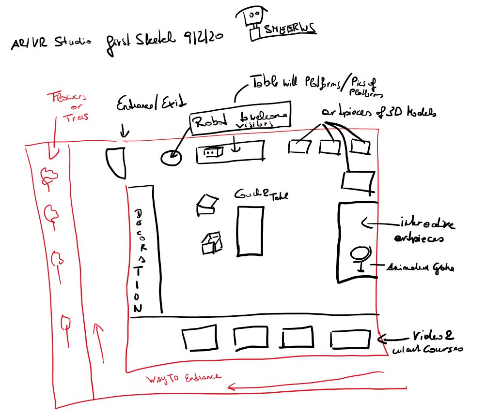

# AR/VR Art|Design|Development Studio

### Project description: 
This project is part of the coursera course 3D Models for Virtual Reality.
It showcases several facets of my work with Virtual Realtiy (VR).  
In a factory environmnent you will experience VR artwork I've made with VR Software, such as, Tilt Brush, Quill, Medium, 
Blocks etc. Traditional videos made based on VR artwork, 3D models I've made in VR, 
development work I've done in this field with Unity.   

### Development platform: 
Windows 10, Unity 2019.1.14f1, 
Visual Studio community 2017 version 15.9.17, SteamVR Plugin 2.5.0 (sdk 1.8.19), 
Scripting Runtime Version: .NET 4.x Equivalent

### Target platform: 
Oculus Rift S/Rift/Vive

### Visuals: 
First sketch:

### Necessary setup/execution steps: 
You need Unity, SteamVR Plugin (imported and installed), a Rift/Vive/Rift S. 
Clone the project, run the project Assets > MyGame > Scenes > MainScene.

### Third party material: 
(if used Fonts, Sounds, Music, Graphics, Materials, Code etc.)
* The factory environmnent I've used in another project. 
In this project I restructured and renamed the GameObjects in the Hierarchy to make the project cleaner. 

  - https://github.com/smeerws/VRND-NightattheMuseum, 

  - https://www.youtube.com/watch?v=4S7aneXMAQU&feature=emb_title
  
* 3D Models & Textures (Asset Store): 
- Tree (Mediterranean): Package isn't downloadable anymore (Deprecated)
- Modular Warehose: Package isn't downloadable anymore (Depricated)
- Free SpeedTrees Package: https://assetstore.unity.com/packages/3d/vegetation/speedtree/free-speedtrees-package-29170
- SurfacesLite: https://assetstore.unity.com/packages/2d/textures-materials/surfaces-lite-89739
- Textures-Brick and Tile: https://assetstore.unity.com/packages/2d/textures-materials/textures-brick-and-tile-71671
- Space Robot Kyle: https://assetstore.unity.com/packages/3d/characters/robots/space-robot-kyle-4696
- Pack Gesta Furniture #1: https://assetstore.unity.com/packages/3d/props/furniture/pack-gesta-furniture-1-28237
- Folding Table and Chair PBR : https://assetstore.unity.com/packages/3d/props/furniture/folding-table-and-chair-pbr-111726
- Sketchfab for Untiy: https://assetstore.unity.com/packages/tools/input-management/sketchfab-for-unity-14302, 
   https://github.com/sketchfab/unity-plugin/releases/tag/1.1.1
- My 3D models: 
+ Medium Ladybug balloon animal: https://sketchfab.com/3d-models/medium-ladybug-balloon-8428f79d22a047d9b28e4920c2e68b42
+ Medium Frog balloon animal: https://sketchfab.com/3d-models/medium-frog-balloon-97a038cd7a304bce81890c118fadd793
### Project state: 
incl. progress in percent

### Limitations:
The AR work is not part of this project yet. 

### Lessons Learned: 

* Install Unity
* Create a Unity 3D project
* Build a Scene with 3D Objects
* Import SteamVR
* Implement locomotion in Unity with SteamVR

Copyright by smeerws
