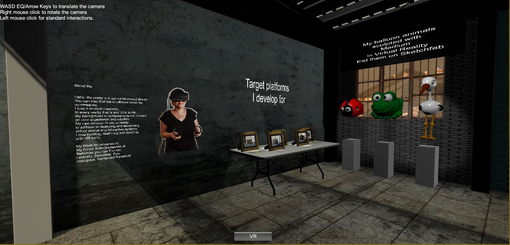
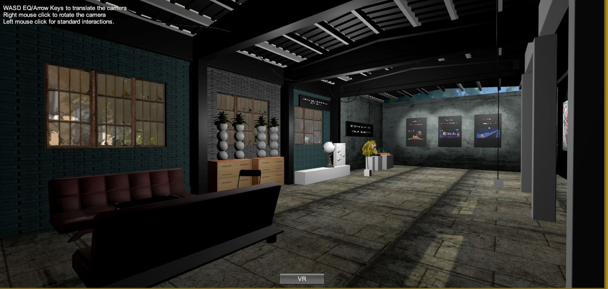
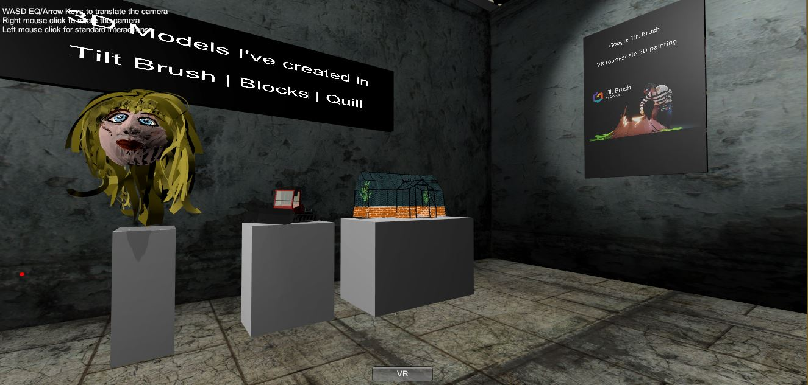
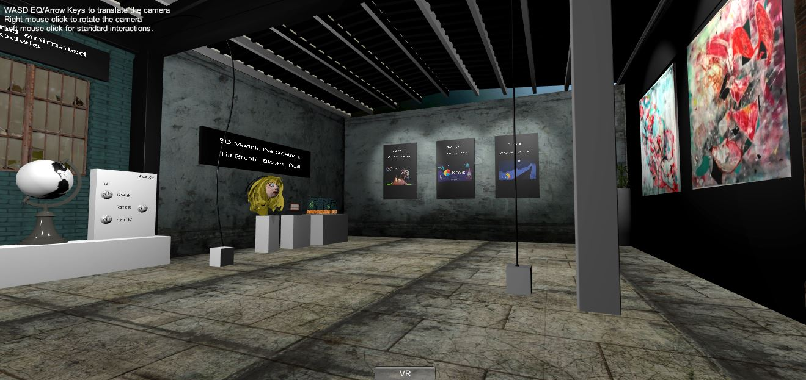

# AR/VR Art|Design|Development Studio

### Project description: 
This project is part of the coursera course *3D Models for Virtual Reality*.
The scene showcases several facets of my work with done in Virtual Reality (VR), such as 3D modeling with VR Tools, 
development and programming. Therefore I've created a factory environment. 
Within this environment you will experience artwork I've made with VR Software, such as 3D models made with Tilt Brush, 
Quill, Medium, Blocks etc. 
In a future update you will see traditional 2D videos I've made in VR for others, 
as well as development work I've done in this field with Unity.   

### Project requirements: 
- [x] You should have a brief description of your scene
- [x] This description should give instructions
- [x] The description should give any restrictions on hardware needed to run the scene
- [x] The scene should contain several 3D objects
- [x] The object should be arranged with transforms to form a scene
- [x] The scene should be viewable in VR
- [x] The objects should have materials including textures
- [x] The scene should be scaled appropriately for VR
- [x] The scene should have appropriate lighting
- [x] (Optional) The scene can have animation
- [x] (Optional) The scene can include audio
- [x] The project should represent a real or imaginary scene

### Development platform: 
Windows 10, Unity 2019.1.14f1, 
Visual Studio community 2017 version 15.9.17, SteamVR Plugin 2.5.0 (sdk 1.8.19), 
Scripting Runtime Version: .NET 4.x Equivalent

### Target platform: 
Oculus Rift S/Rift/Vive. The VR experience is tested and optimized for the Oculus Rift S platform.

### Visuals: 
First sketch: 

First screenshot MainScene:  

Final screenshots MainScene:  

### Necessary setup/execution steps: 
In general, you need Unity, SteamVR Plugin (imported and installed), a Rift/Vive/Rift S.
Clone the project, run the project Assets > MyGame > Scenes > MainScene.

All Plugins are in this project. If there are issues with SteamVR, delete the Plugin in the project and reimport and install it from the Unity Asset Store. 

### Third party material: 
* The used factory environment in this project I've used in another project before: 
  - https://github.com/smeerws/VRND-NightattheMuseum
  - https://www.youtube.com/watch?v=4S7aneXMAQU&feature=emb_title

  In this project I restructured and renamed the GameObjects in the Hierarchy to make the project cleaner. 
* Sketchfab for Untiy: https://assetstore.unity.com/packages/tools/input-management/sketchfab-for-unity-14302, 
   https://github.com/sketchfab/unity-plugin/releases/tag/1.1.1
* 3D Models & Textures (Asset Store): 
  - Tree (Mediterranean): Package isn't downloadable anymore (Deprecated)
  - Modular Warehouse: Package isn't downloadable anymore (Deprecated)
  - Free SpeedTrees Package: https://assetstore.unity.com/packages/3d/vegetation/speedtree/free-speedtrees-package-29170
  - SurfacesLite: https://assetstore.unity.com/packages/2d/textures-materials/surfaces-lite-89739
  - Textures-Brick and Tile: https://assetstore.unity.com/packages/2d/textures-materials/textures-brick-and-tile-71671
  - Space Robot Kyle: https://assetstore.unity.com/packages/3d/characters/robots/space-robot-kyle-4696
  - Pack Gesta Furniture #1: https://assetstore.unity.com/packages/3d/props/furniture/pack-gesta-furniture-1-28237
  - Folding Table and Chair PBR : https://assetstore.unity.com/packages/3d/props/furniture/folding-table-and-chair-pbr-111726
  - Picture Frame:  https://sketchfab.com/3d-models/picture-frame-17c28540fa0d407aacc46407baa065a4
  - My sculpted 3D models: 
    + Medium Ladybug balloon animal: https://sketchfab.com/3d-models/medium-ladybug-balloon-8428f79d22a047d9b28e4920c2e68b42
    + Medium Frog balloon animal: https://sketchfab.com/3d-models/medium-frog-balloon-97a038cd7a304bce81890c118fadd793
	+ Medim Stork-Balloon animial: https://sketchfab.com/3d-models/medium-stork-balloon-77a69733b5cc4ef494257a85be34371b
* SteamVR Plugin: https://assetstore.unity.com/packages/tools/integration/steamvr-plugin-32647

### Project state: 
- [x] Project ideation
- [x] Basic factory environment (3D Models)
- [x] SteamVR import
- [x] V1 locomotion and teleportation
- [x] Whiteboxing Medium models
- [x] Import Medium models with textures
- [x] Whiteboxing Quill models
- [x] Whiteboxing Tilt Brush models
- [x] V1 Animation Globe
- [x] Write Script globe anim right/left/stop
- [x] Sound Factory/Street
- [x] V1 Skybox
- [ ] Animation Robot (optional)
- [ ] Sound Robot (optional)
- [ ] Sound Radio (optional)
- [ ] Video import (optional)
- [ ] Write Scripts (optional Radio:sound/light on/off, Video stop/play)

### Limitations:
The AR work is not part of this project yet. 
Teleport area isn't accurate yet, it is possible to teleport into walls. 
Open issues: SteamVR resize/scale player results in hands offset. 
Optional planned parts are not realized yet, due to lack of time.
The skybox has to be adjusted.

### Problems:
Multiple precompiled assembly execption: Sketchfab for Unity and Tiltbrush package use asseblies with the same name. Resolved
the problem by deleting the sketchfab for unity package in the project pane and restarted unity. 

### Lessons Learned: 

* Install Unity
* Create a Unity 3D project
* Build a Scene with 3D Objects
* Import SteamVR
* Implement locomotion in Unity with SteamVR
* Pipeline Medium export fbx with textures, import fbx with textures into Unity: file:///C:/Users/hello/Downloads/Oculus%20Medium%20-%20Export%20Pipeline.pdf
* Using UI Elements in VR: 
  * Way1 Click with controller trigger (Create a 2D Button, add Interactable Script, add UI Element Script-add your clickbahaviour script, add Box Collider)
  * Way2 Hover Button see SteamVR examples: press button with Hand
* Pipeline Tilt Brush export fbx with textures and import into unity. To use shaders etc. go to https://github.com/googlevr/tilt-brush-toolkit resp. https://github.com/googlevr/tilt-brush-toolkit/releases and download 
  Unity SDK v22.0.0. Afterwards copy the exported fbx model files from Tilt Brush (Go to Labs, than export, export is saved in Documents/TiltBrush/Export)) in your project. 
  
Copyright by smeerws
